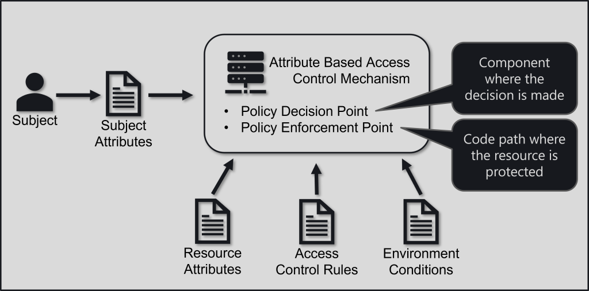
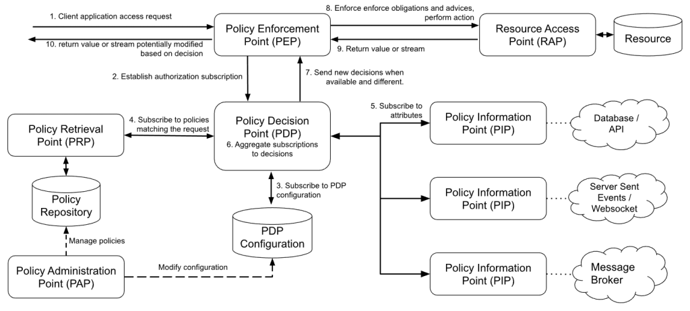

# SAPL Axon Framework Integration

This library supports the implementation of Attribute-based Access Control (ABAC) and Attribute Stream-based Access Control (ASBAC) in applications using the Axon Framework. 

## What is Attribute-based Access Control?

Attribute-based Access Control (ABAC) is an expressive access control model. 
In this tutorial, you will learn how secure services and APIs of a Spring Boot application using the SAPL Engine to implement ABAC. The tutorial assumes basic familiarity with the development process of Spring applications.



ABAC decides on granting access by inspecting attributes of the subject, resource, action, and environment. 

The subject is the user or system requesting access to a resource. Attributes may include information such as the user's department in an organization, a security clearance level, schedules, location, or qualifications in the form of certifications.

The action is how the subject attempts to access the resource. An action may be one of the typical CRUD operations or something more domain-specific like "assign new operator," and attributes could include parameters of the operation.

Resource attributes may include owners, security classification, categories, or other arbitrary domain-specific data.

Environment attributes include data like the system and infrastructure context or time.

An application performing authorization of an action formulates an authorization question by collecting attributes of the subject, action, resource, and environment as required by the domain and asks a decision-making component which then makes a decision based on domain-specific rules which the application then has to enforce.

### The SAPL Attribute-Based Access Control (ABAC) Architecture

SAPL implements its interpretation of ABAC called Attribute Stream-Based Access Control (ASBAC). It uses publish-subscribe as its primary mode of interaction between the individual components. This tutorial will explain the basic ideas. The [SAPL Documentation](https://sapl.io/docs/2.1.0-SNAPSHOT/sapl-reference.html#reference-architecture) provides a more complete discussion of the architecture. 



In your application, there will be several code paths where a subject attempts to perform some action on a resource, and based on the domain's requirements, the action must be authorized. For example, in a zero-trust system, all actions triggered by users or other components must be explicitly authorized. 

A *Policy Enforcement Point (PEP)* is the logic in your application in these code paths that do:
* mediate access to the *Resource Access Point (RAP)*, i.e., the component executing the action and potentially retrieving data 
* formulate the authorization question in the form of an *authorization subscription*, i.e., a JSON object containing values for the subject, resource, action, and possibly the environment. The PEP determines the values based on the domain and context of the current attempt to execute the action.
* delegates the decision-making for the authorization question to the *Policy Decision Point (PDP)* by subscribing to it using the authorization subscription.
* enforces all decisions made by the PDP.

## Maven Dependencies and Project Setup

The SAPL Axon extension currently resides in the ```2.1.0-SNAPSHOT``` version of SAPL. For Maven to be able to download the respective libraries, add the central snapshot repository to the POM:

```xml
    <repositories>
        <repository>
            <id>ossrh</id>
            <url>https://s01.oss.sonatype.org/content/repositories/snapshots</url>
            <snapshots>
                <enabled>true</enabled>
            </snapshots>
        </repository>
    </repositories>
```

SAPL provides a bill of materials module, helping you to use compatible versions of SAPL modules. After adding the following to your POM, future dependencies can omit  the ```<version>``` tag of individual SAPL dependencies:

```xml
    <dependencyManagement>
        <dependencies>
            <dependency>
                <groupId>io.sapl</groupId>
                <artifactId>sapl-bom</artifactId>
                <version>2.1.0-SNAPSHOT</version>
                <type>pom</type>
                <scope>import</scope>
            </dependency>
        </dependencies>
    </dependencyManagement>
```
 
To develop an application using SAPL, the project rquires two components. First, it needs a component for making authorization decisions, the so-called policy decision point (PDP). SAPL supports embedfing the PDP within your application or to use a dedicated server application and delegate the decision-making to this remote service. For an embedded PDP making decisions locally based on policies stored in the application resources. The following dependency is responsible:

```xml
        <dependency>
            <groupId>io.sapl</groupId>
            <artifactId>sapl-spring-pdp-embedded</artifactId>
        </dependency>
```

For connecting to using PDP servers, use ```<artifactId>sapl-spring-pdp-embedded</artifactId>```.


SAPL provides a deep integration with Axon and Spring Security. This integration enables simple deployment of policy enforcement points in Spring application using a declarative aspect-oriented programming style. Add the following dependency to your project:

```xml
        <dependency>
            <groupId>io.sapl</groupId>
            <artifactId>sapl-axon</artifactId>
        </dependency>
```

Finally, the embedded PDP (in its default configuration) requires a folder in the resources ```src/main/resources``` called ```policies```, and a configuration file called ```pdp.json```. To start add the following content to this file: 

```json
{
    "algorithm": "DENY_UNLESS_PERMIT",
    "variables": {}
}
```

The ```algorithm``` property selects an algorithm used to resolve conflicting results from policy evaluation. In this case, the algorithm will ensure that the PDP always returns a ```deny``` decision if no policy evaluation returns an explicit ```permit``` decision. You can use the ```variables``` property to define environment variables, e.g., the configuration of policy information points (PIPs). All policies can access the content of these variables.

